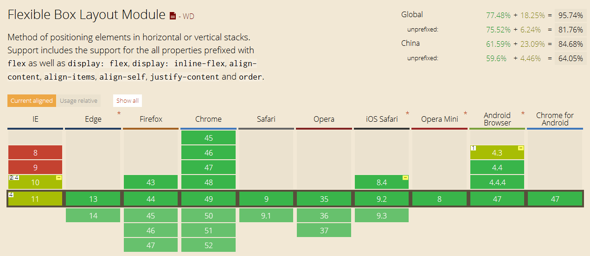

###所有主流浏览器均支持

我还没有使用Flexbox的主要原因是我认为缺乏浏览器的支持。但事实上，Flexbox以95.89％的比率在全球浏览器得到了很好的支持。如果你不考虑IE 10及以下的版本，Microsoft表示现在可以这样认为，这个数字甚至可以更高。



###不必担心语法

虽然所有浏览器的最新版本均支持Flexbox目前的语法，那老版本的支持如何呢？因为语法的改变已经半年多了，在书写方面存在一些不一致的地方。为了支持所有浏览器目前最后的两个版本，我们将不得不使用不同供应商前缀，每条规则至少书写4个不同的版本。

关于这个问题，我的解决方案是只需使用autoprefixer。跟踪最好使用哪个供应商前缀，不应该占用我们的时间和精力，所以我们应该将其设置为自动化。

使用 autoprefixer，我们可以指定我们想要支持的浏览器版本，然后他就会自动添加相应的供应商前缀。

```
/* Write this */
.flex-container {
  display: flex;
}

/* Compiles to this (with autoprefixer set to support last 2 versions of all browsers) */
.flex-container {
  display: -webkit-box;
  display: -webkit-flex;
  display: -ms-flexbox;
  display: flex;
}
```

###简单的开始

诚然，学习所有flexbox 相关的知识并不是那么简单。它有12个新属性，其中每个大约有 4个潜在值。当然你可以一点一点的去理解掌握。

**但是你并不需要去了解所有的属性。**因为在很多情况下，我发现自己只需要使用 3 个属性-

+ display：将元素设置为内联或者块flexbox容器元素
+ justify-content： 控制 flex 容器内项的水平对齐方式 (如果 flex 的默认属性为 row 或 row-reverse)
+ align-items: 控制 flex 容器内项的垂直对齐方式 (如果 flex 的默认属性为 row 或 row-reverse)

使用这些仅适用于 flex 容器的属性，我们可以产生大量不同的布局。如果你想要了解更多相关知识，还有丰富的资源/属性列表/帮助你学习的例子

+ [Flexbox中文教程](http://www.w3cplus.com/blog/tags/157.html)
+ [Flexbox Playground](http://codepen.io/enxaneta/full/adLPwv/)：一个在线文档，你可以验证每个属性-值对的作用
+ [Flexbox 完全指南(CSS 技巧)](https://css-tricks.com/snippets/css/a-guide-to-flexbox/): 所有 flexbox 概述
+ [Flexbox Froggy](http://flexboxfroggy.com/): 学习 CSS flexbox 的游戏
+ [Flexbugs](https://github.com/philipwalton/flexbugs): flexbox 问题的列表以及解决他们跨浏览器问题的方法
+ [Flexibility](https://github.com/10up/flexibility):支持旧版浏览器的一个polyfill
 
###元素居中

除了 flexbox 良好的浏览器支持，我们还可以很轻松的实现元素在水平垂直居中问题。

仅仅需要3个声明，我们就可以实现子元素完全居中:

```
.flex-container {
  display: flex;
  justify-content: center; /* horizontal centering */
  align-items: center; /* vertical centering */

  border: 2px dashed #000;
}
```


###更容易地操作内联元素

关于内联项定位问题就是臭名昭著的额外的4个像素的外边距。虽然存在解决这个问题的方法，如浮动元素，但随时就会出现新的问题。

使用Flexbox，我们就可以毫不费力地处理内联元素。我们可以实现元素的**两端对齐**对齐：

```
.flex-container { display: flex; }
.flex-item { width: 20%; }
```


我们可以实现项与项之间的**均匀分布**

```
.flex-container {
  display: flex;
  justify-content: space-around;
}
```


我们甚至可以在不处理:first-child或:last-child的情况下，实现列表项的均匀分布：

```
.flex-container {
  display: flex;
  justify-content: space-between;
}
```


###简化了复杂性

究其Flexbox的创建原因，首先可能是因为这个原因，让我们实现在尽可能少的声明中创建复杂的布局。

在前面的例子中，我仅仅通过设置flex容器样式来实现。然而，我们可以通过设置 flex 项来实现更加精细的样式调节。例如，定价表的通用布局:


这里有三个 div，中间div的宽度是两边的两倍。为了使用flexbox实现这种布局，我们可以这样书写。

```
.flex-container {
  display: flex;
  align-items: center;
}

.flex-items:not(:nth-child(2)) {
  flex-grow: 1;
  height: 300px;
}

.flex-items:nth-child(2) {
  flex-grow: 2;
  height: 350px;
}
```

关于Felxbox，我的意识已经很晚了，但是我仍然相信还有许多人的思想没有改变。您已经使用 flexbox 了吗?如果没有，您是不是已经被信服，要试一试呢?

[原文链接](http://www.w3cplus.com/css3/6-reasons-to-start-using-flexbox.html)
